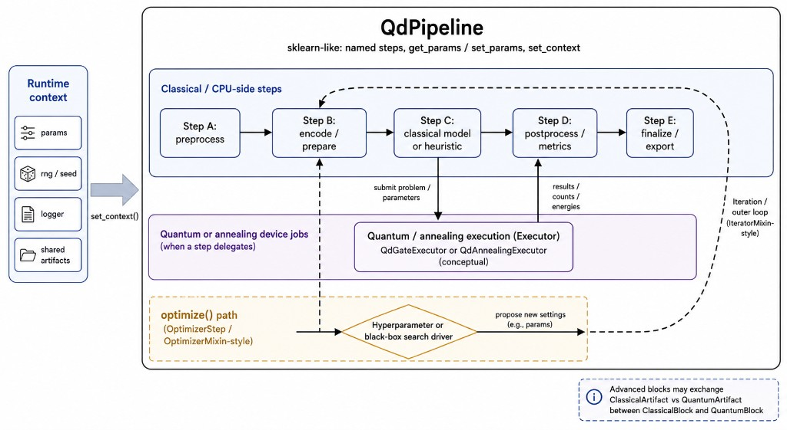
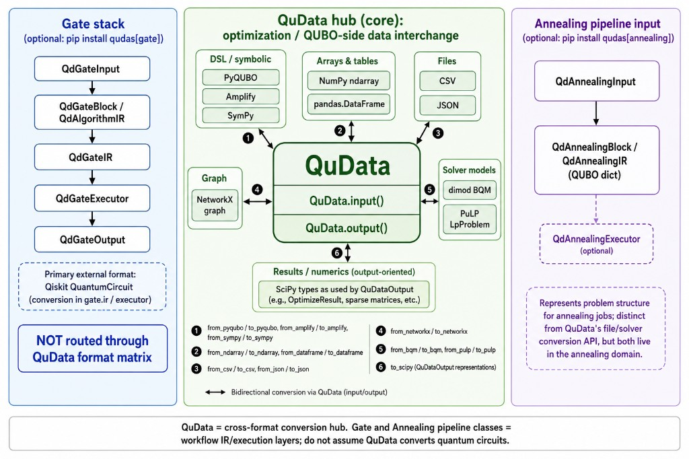

# Qudas (Quantum Data Transformation Library)

Qudasは、**量子計算と古典最適化をまたいだワークフロー**を組み立てるための Python ライブラリです。役割は大きく次の三つに分かれます。

1. **パイプライン（`QdPipeline`）** — 名前付きステップ、`get_params` / `set_params`、`set_context` によるランタイム注入など、scikit-learn に近い操作で古典側の処理列を記述し、量子／アニーリング Executor への委譲や外側の反復・最適化ループと組み合わせられます。
2. **QuData** — 最適化・QUBO まわりの表現（NumPy、pandas、CSV／JSON、PyQUBO、Amplify、dimod、PuLP など）を `QuData.input()` / `QuData.output()` と `from_*`／`to_*` で行き来させる**形式変換のハブ**です。量子回路そのものの変換は担当せず、回路はゲート用スタック（Qiskit 連携）で扱います。
3. **ゲート／アニーリング（オプション）** — `qudas[gate]` と `qudas[annealing]` で追加される、それぞれ回路実行用・アニーリングジョブ用の入出力・IR・Executor 層です（QuData のファイル／ソルバ変換 API とは別レイヤーですが、QUBO 表現まわりで併用しやすい構成です）。

Sphinx による API ドキュメントはリポジトリ内の [`sphinx_docs/source/`](sphinx_docs/source/) をソースとし、ビルド手順は [`DEVELOPER.md`](DEVELOPER.md) を参照してください。公開用にビルドした静的 HTML は [`docs/latest/`](docs/latest/) に置く運用が可能です。

本 README は

1. ライブラリ利用者向けドキュメント (Install / 全体像 / How-to)
2. 開発者向けドキュメント (開発フロー / コントリビュート手順)

の 2 つのセクションで構成されています。

---

## 1️⃣ ライブラリ利用者向けドキュメント

### 1-1. インストール
```bash
pip install qudas  # コアのみ（numpy + matplotlib）
pip install "qudas[annealing]"  # zsh 等では角括弧をクォート推奨
pip install "qudas[gate]"
pip install "qudas[all]"
# or
pip install git+https://github.com/devel-system/qudas.git@v0.2.1  # 開発版
```

**オプション**（zsh などでは角括弧をクォートしてください。上記コードブロック参照）
- `pip install qudas` … コアのみ（numpy + matplotlib）
- `pip install qudas[gate]` … 量子ゲート（Qiskit）
- `pip install qudas[annealing]` … アニーリング・データ変換一式（dimod, Amplify, PyQUBO, PuLP, pandas, networkx, sympy, scipy）
- `pip install qudas[all]` … 上記 gate + annealing の全パッケージ

### 1-2. ライブラリの全体像（構成図）

v0.2.1 時点でドキュメントと揃えた概念図です（GitHub 上の README では下記パスの画像が表示されます）。

**QdPipeline** … ランタイムコンテキスト、古典ステップ列、Executor への委譲、最適化ループのフィードバックなどの関係。



**QuData とゲート／アニーリング** … 中央の QuData が最適化・QUBO 系データの相互変換ハブ、左がゲートスタック（QuData の行列ハブを経由しない）、右がアニーリング用パイプライン。



### 1-3. クイックスタート
以下では代表的なユースケースを抜粋します。詳細は [examples/](examples/) も参照してください。

#### 1-3-1. QuData の生成
```python
from qudas import QuData

# QUBO (dict) から生成
qubo = {('q0', 'q1'): 1.0, ('q2', 'q2'): -1.0}
qudata = QuData.input(qubo)
print(qudata.prob)               # => {('q0', 'q1'): 1.0, ('q2', 'q2'): -1.0}
```

#### 1-3-2. 四則演算
```python
q1 = QuData.input({('q0', 'q1'): 1.0})
q2 = QuData.input({('q0', 'q0'): 2.0})
print((q1 + q2).prob)            # => {('q0','q1'):1.0, ('q0','q0'):2.0}
print((q1 ** 2).prob)            # => {('q0','q1'):1.0, ('q0','q2','q1'):-2.0}
```

#### 1-3-3. データ形式変換
| from | to | サンプルコード |
|------|----|----------------|
| PyQUBO | Amplify | `QuData.input().from_pyqubo(expr).to_amplify()` |
| NumPy 配列 | dimod-BQM | `QuData.input().from_array(arr).to_dimod_bqm()` |
| CSV | PuLP | `QuData.input().from_csv('qudata.csv').to_pulp()` |

### データ形式の変換（QuDataInput）
デバイスへの様々な入力形式のデータを `QuData` オブジェクトを介して変換することができます。

#### pyqubo から Amplify への変換
```python
from pyqubo import Binary
from qudas import QuData

# Pyqubo で問題を定義
q0, q1 = Binary("q0"), Binary("q1")
prob = (q0 + q1) ** 2

# QuData に Pyqubo の問題を渡す
qudata = QuData.input().from_pyqubo(prob)
print(qudata.qubo)  # 出力: {('q0', 'q0'): 1.0, ('q0', 'q1'): 2.0, ('q1', 'q1'): 1.0}

# Amplify 形式に変換
amplify_prob = qudata.to_amplify()
print(amplify_prob)
```

#### 配列から BQM への変換
```python
import numpy as np
from qudas import QuData

# Numpy 配列を定義
prob = np.array([
    [1, 1, 0],
    [0, 2, 0],
    [0, 0, -1],
])

# QuData に配列を渡す
qudata = QuData.input().from_array(prob)
print(qudata.qubo)  # 出力: {('q_0', 'q_0'): 1, ('q_0', 'q_1'): 1, ('q_1', 'q_1'): 2, ('q_2', 'q_2'): -1}

# BQM 形式に変換
bqm_prob = qudata.to_dimod_bqm()
print(bqm_prob)
```

#### CSV から PuLP への変換
```python
import pulp
from qudas import QuData

# CSVファイルのパス
csv_file_path = './data/qudata.csv'

# QuData に CSV を渡す
qudata = QuData.input().from_csv(csv_file_path)
print(qudata.qubo)  # 出力: {('q_0', 'q_0'): 1.0, ('q_0', 'q_2'): 2.0, ...}

# PuLP 形式に変換
pulp_prob = qudata.to_pulp()
print(pulp_prob)
```

### データ形式の変換（QuDataOutput）
デバイスからの様々な出力形式のデータを `QuData` オブジェクトを介して変換することができます。

#### PuLP から Amplify への変換
```python
import pulp
from qudas import QuData

# PuLP問題を定義して解く
prob = pulp.LpProblem("Test Problem", pulp.LpMinimize)
x = pulp.LpVariable('x', lowBound=0, upBound=1, cat='Binary')
y = pulp.LpVariable('y', lowBound=0, upBound=1, cat='Binary')
prob += 2*x - y
prob.solve()

# QuDataOutputのインスタンスを生成し、from_pulpメソッドで問題を変換
qudata = QuData.output().from_pulp(prob)
print(qudata.qubo)  # 出力: {'x': 2.0, 'y': -1.0}

# Amplify形式に変換
amplify_prob = qudata.to_amplify()
print(amplify_prob)  # 出力: Amplifyの目標関数形式
```

#### SciPy から Dimod への変換
```python
import numpy as np
from sympy import symbols, lambdify
from scipy.optimize import minimize, Bounds
from qudas import QuData

# シンボリック変数の定義
q0, q1, q2 = symbols('q0 q1 q2')

# 目的関数を定義
objective_function = 2 * q0 - q1 - q2

# シンボリック関数を数値化して評価できる形式に変換
f = lambdify([q0, q1, q2], objective_function, 'numpy')

# 初期解 (すべて0.5に設定)
q = [0.5, 0.5, 0.5]

# バイナリ変数の範囲を定義 (0 <= x <= 1)
bounds = Bounds([0, 0, 0], [1, 1, 1])

# SciPyで制約付き最適化を実行
res = minimize(lambda q: f(q[0], q[1], q[2]), q, method='SLSQP', bounds=bounds)

# QuDataOutputのインスタンスを生成し、from_scipyメソッドをテスト
qudata = QuData.output().from_scipy(res)
print(qudata.qubo)  # 出力: {'q0': 2, 'q1': -1, 'q2': -1}

# Dimod形式に変換
dimod_prob = qudata.to_dimod_bqm()
print(dimod_prob)  # 出力: DimodのBQM形式
```

---

### 1-4. **NEW** 量子ゲート実行 (v0.2 系で追加)
量子ゲート方式の回路を `QdGateExecutor` で実行できます。`qudas[gate]` を入れると Qiskit 系依存が揃い、内部ではシミュレータを呼び出します。

以下ではテストコードと同様に、代表的な 4 パターンの実行／変換例を示します。

#### 1-4-1. 純粋な Qudas での実行
```python
from qudas.gate import (
    QdGateIR, QdGateBlock,
    QdGateInput, QdGateExecutor,
)

# H + CX でベル状態を生成する 2qubit 回路
gates = [
    QdGateIR(gate='h', targets=[0]),
    QdGateIR(gate='cx', targets=[1], controls=[0]),
]
block = QdGateBlock(label='bell', gates=gates, num_qubits=2)
qd_input = QdGateInput(blocks=[block])

# 実行
executor = QdGateExecutor(provider='default')
output = executor.run(qd_input)
print(output.results['bell'])  # => {'counts': {'00': 512, '11': 512}, 'device': 'qiskit'}
```

#### 1-4-2. Qudas の回路 → Qiskit へ変換して実行
```python
from qudas.gate import (
    QdGateIR, QdGateBlock,
    QdGateInput, QdGateExecutor,
)
from qiskit.primitives import Sampler

# H + CX でベル状態を生成する 2qubit 回路
gates = [
    QdGateIR(gate='h', targets=[0]),
    QdGateIR(gate='cx', targets=[1], controls=[0]),
]
block = QdGateBlock(label='bell', gates=gates, num_qubits=2)

ir = block.to_ir()               # QdGateBlock → QdAlgorithmIR
qc = ir.to_qiskit()              # → qiskit.QuantumCircuit
qc.measure_all()

sampler = Sampler()
result = sampler.run([qc], shots=256).result()
counts = result.quasi_dists[0]
print(counts)
```

#### 1-4-3. 外部フレームワーク (Qiskit) の回路 → Qudas で実行
```python
from qiskit import QuantumCircuit
qc = QuantumCircuit(1, 1)
qc.h(0)
qc.measure(0, 0)

# Qiskit → QdAlgorithmIR
from qudas.gate.ir import QdAlgorithmIR
ir = QdAlgorithmIR.from_qasm(qc)

# QdAlgorithmIR → QdGateBlock → Qudas 実行
block = QdGateBlock(label='block0', gates=ir.gates, num_qubits=1)
qd_input = QdGateInput(blocks=[block])
output = QdGateExecutor().run(qd_input)
print(output.results["block0"])
```

#### 1-4-4. 外部フレームワーク → さらに別フレームワークへ変換して実行
```python
from qiskit import QuantumCircuit, qasm2
from qiskit.primitives import Sampler

# オリジナル回路
qc_original = QuantumCircuit(1, 1)
qc_original.x(0)
qc_original.measure(0, 0)

# Qiskit → OpenQASM 文字列
qasm_str = qasm2.dumps(qc_original)

# OpenQASM → QdAlgorithmIR (qudas) → Qiskit 再生成
from qudas.gate.ir import QdAlgorithmIR
ir = QdAlgorithmIR.from_qasm(qasm_str)
qc_converted = ir.to_qiskit()

# 別 backend (再度 Qiskit シミュレータ) で実行
sampler = Sampler()
result = sampler.run([qc_converted], shots=128).result()
counts = result.quasi_dists[0]
print(counts)
```

* 複数ブロックを並列に実行したい場合は `QdGateExecutor.run_split()` を利用してください。

### 1-5. **NEW** アニーリング実行 API (v0.2 系で追加)
v0.1 にはアニーリング実行 API は存在しません。v0.2 で新規に追加されました。以下の使用例をご参照ください。

#### 使用例
```python
from qudas.annealing import QdAnnealingInput, QdAnnealingBlock, QdAnnealingExecutor

# QUBO と Block を用意
qubo = {('q0', 'q1'): 1.0, ('q1', 'q1'): -1.0}
block = QdAnnealingBlock(qubo, label='block0')

# 入力 & 実行
qd_input = QdAnnealingInput([block])
executor = QdAnnealingExecutor(provider='default')
output = executor.run(qd_input)

# 結果
solution = output.results["block0"]["solution"]
energy = output.results["block0"]["energy"]
device = output.results["block0"]["device"]
print(solution, energy, device)
```

### 1-6. パイプライン（`QdPipeline` / `Pipeline`）

古典・量子ステップを名前付きでつなぐパイプラインは `qudas.pipeline` の `QdPipeline`（互換別名 `Pipeline`）を利用します。具体例は [examples/fmqa/main.py](examples/fmqa/main.py)、[examples/vqe/run_vqe.py](examples/vqe/run_vqe.py)、[examples/qsvm-gate/main.py](examples/qsvm-gate/main.py) および [tests/test_pipeline.py](tests/test_pipeline.py) を参照してください。v0.2.1 では実行結果への統計情報（`qudas.core.statistics`）なども拡張されています。

---

## ライセンス
このプロジェクトはApache-2.0ライセンスの下で提供されています。詳細は`LICENSE`ファイルを参照してください。

## 謝辞
本成果は、国立研究開発法人新エネルギー・産業技術総合開発機構 (ＮＥＤＯ) の助成事業として得られたものです。

---

## 開発者向けドキュメント

開発に関する詳細な手順やガイドラインは `DEVELOPER.md` を参照してください。

## テストコード

自動テストは `tests/` にあります。`qudata`・ゲート・アニーリング・パイプラインごとにモジュールを分けています。手動で動作確認するスクリプトは `examples/manual/` を参照してください。

実行方法は `DEVELOPER.md` の「テスト」節を参照してください。
